# **Kafka Web UI By LCC**

# **项目介绍**

**Kafka Web UI By LCC** 是一个专为简化Apache Kafka集群管理和操作而设计的图形化用户界面（GUI）。该项目旨在为开发者、运维人员和数据科学家提供一个直观且易用的平台，以进行Kafka主题（Topic）管理、消息生产和消费、以及集群监控等任务。通过该工具，用户无需编写复杂的命令行指令，即可轻松完成日常维护工作，并能更有效地监控和优化Kafka集群性能。

## 开发背景

随着大数据处理需求的增长，Apache Kafka作为一款高性能分布式消息队列系统，被广泛应用于日志收集、流数据分析等领域。然而，传统的命令行工具对于非技术人员来说具有较高的使用门槛。因此，我们开发了Kafka Web UI By LCC，致力于降低Kafka使用的复杂度，提升用户体验。本项目不仅适用于初学者快速上手学习Kafka的基本概念和操作，也为专业用户提供了一个强大的辅助工具，助力其在实际工作中更加高效地管理Kafka集群。

## 主要功能特性

- **直观的主题管理**：支持创建、编辑和删除Kafka主题，同时提供详细的元数据查看选项。
- **消息生产与消费**：内置的消息生产者和消费者工具，允许用户直接从Web界面向主题发送消息或订阅并接收消息。
- **全面的集群监控**：实时监控Kafka集群状态，包括但不限于节点状况、数据吞吐速率、内存占用指标等。
- **消费者组管理**：便捷地管理和调整消费者组配置，如重置偏移量、检查滞后情况等。
- **丰富的可视化图表**：利用图表展示关键性能指标，帮助用户快速理解集群运作模式。
- **多环境兼容性**：无论是本地开发环境还是云端部署，Kafka Web UI By LCC都能无缝对接各种规模的Kafka集群。


# Quick Start

拉取Docker镜像

```bash
docker pull lcc1024/kafka_ui_lcc:1.0
```

创建KafkaUILCC的文件夹

```bash
mkdir -p /usr/local/KafkaUILCC/config
```

编写KafkaUILCC的配置文件

```bash
vim /usr/local/KafkaUILCC/config/application.properties
```

文件内容如下：

```bash
# zookeeper_connect
zookeeper.host=你的zookeeper连接地址
zookeeper.port=你的zookeeper连接端口
zookeeper.session_timeout=连接超时时间
```

开启Kafka集群的JMX端口

```bash
vim bin/kafka-server-start.sh
```

在集群**每个节点**的启动脚本中编写如下配置

```bash
# 设置 JMX 监控的端口号
export JMX_PORT=9502
# 设置 JMX 监控的访问权限控制
export KAFKA_JMX_OPTS="-Dcom.sun.management.jmxremote.authenticate=false -Dcom.sun.management.jmxremote.ssl=false -Dcom.sun.management.jmxremote.port=$JMX_PORT -Djava.rmi.server.hostname=<Kafka服务器的IP或主机名>"
```

启动KafkaUILCC容器

```bash
docker run -d --name KafkaUILCC -p 8093:8093 -v /usr/local/KafkaUILCC/config/application.properties:/application.properties lcc1024/kafka_ui_lcc:1.0
```

浏览器输入以下网址即可访问

```bash
http://你部署的服务器ip:8093
```

# 使用说明

项目体验在线访问地址：http://139.9.3.61:8093/

## 集群监控

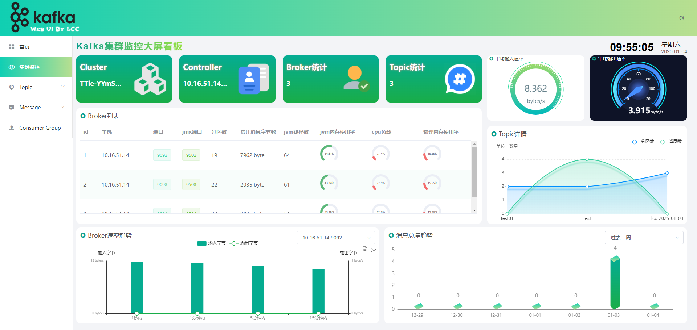

该界面对一些Kafka集群的指标进行统计并以图表的形式进行展示，主要包含集群的元数据信息、Broker的消息速率、数量、内存使用率等信息。

## Topic

### Topic列表

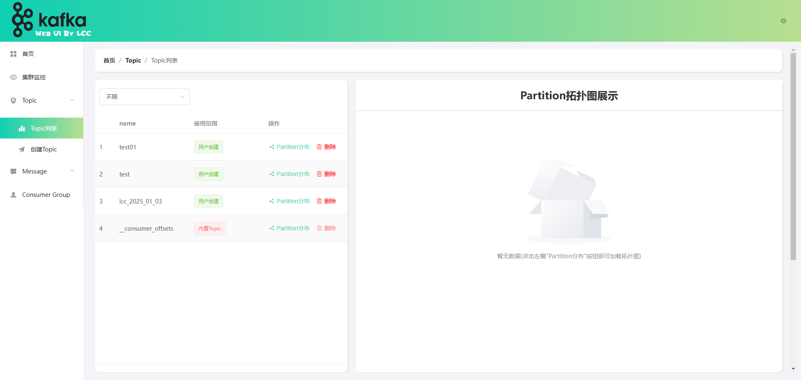

这一模块中我们列出了集群中的所有Topic，可以根据使用范围筛选出Topic，也可点击查看其Partition分布图，同时还支持删除指定Topic

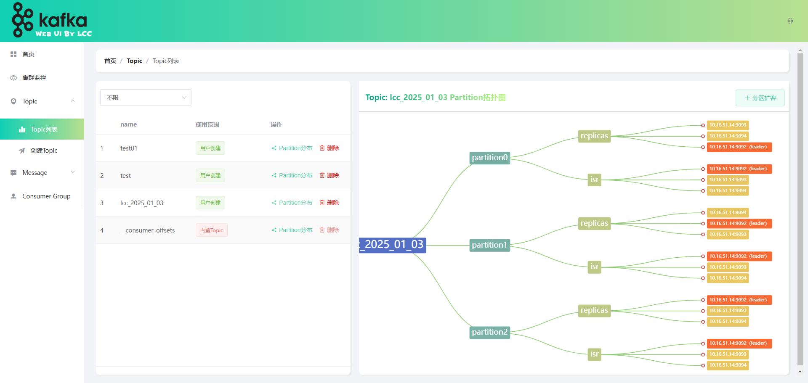


Partition分布如上图，可以识别出分区副本、isr列表，以及指明其leader节点，同时还支持分区扩容操作

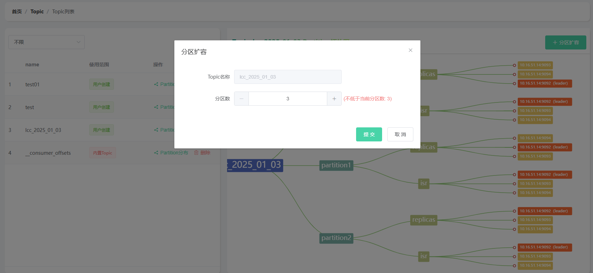

### 创建Topic

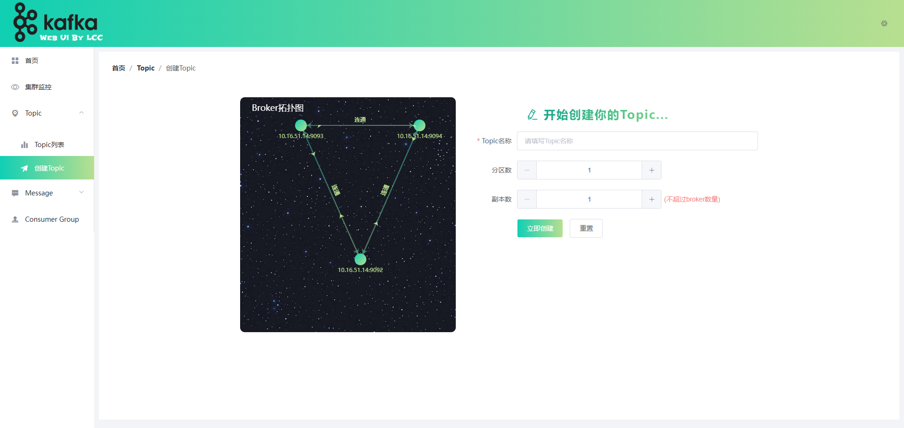

这一模块首先展示了Broker拓扑图，是否连通、拓扑分布是怎样的。此外，填写Topic名称、分区数、副本数可以创建新的Topic

## Message

### 消息列表

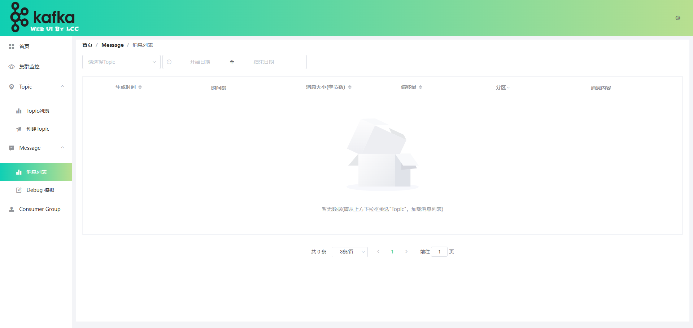

这一模块展示了Kafka集群中的所有消息列表，通过筛选面板可以根据Topic、日期筛选查询出符合条件的消息

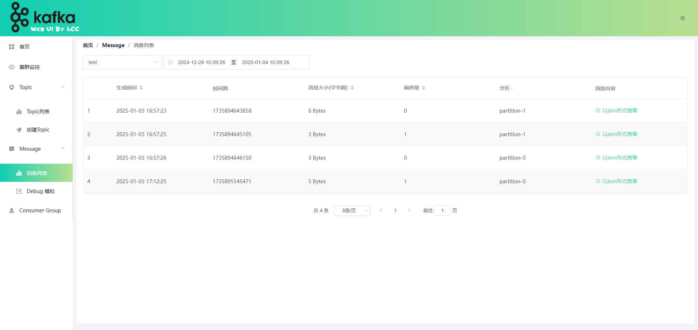

### Debug模拟

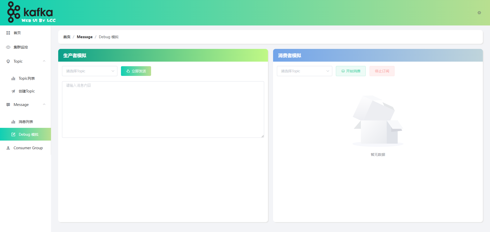

这一模块可以实现**生产者和消费者模拟**功能

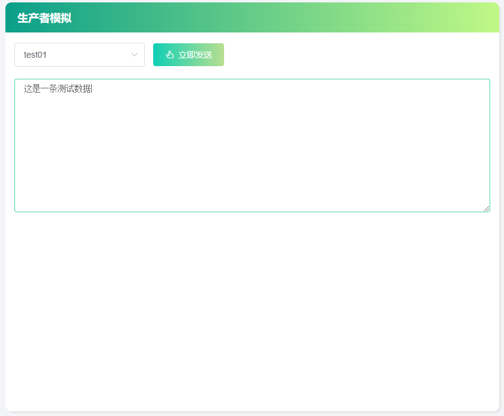

选择好Topic，输入消息即可完成生产者消息的发送

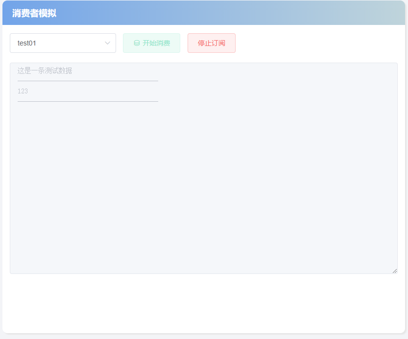

选择好Topic，点击开始消费，即可实时接收消息

## Consumer Group


这一模块展示了消费者组的详细信息，在第一个tab页包含所有，点击消费详情即可查看消费者组的详细消费信息


在消费详情中首先展示了其Broker节点、Topic数等统计信息

除此之外还有分区消费情况和消费组成员列表

分区消费情况展示了当前消费者组订阅的所有分区，及其在这个分区上的消息消费情况，同时还支持修改消费偏移量操作


消费者组成员列表展示了当前消费者组内所有消费者客户端的信息。具体来说，包含消费者客户端的主机名、订阅的分区列表、id等信息

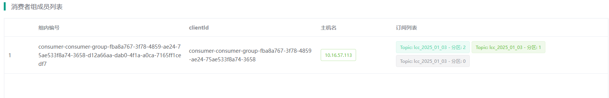
